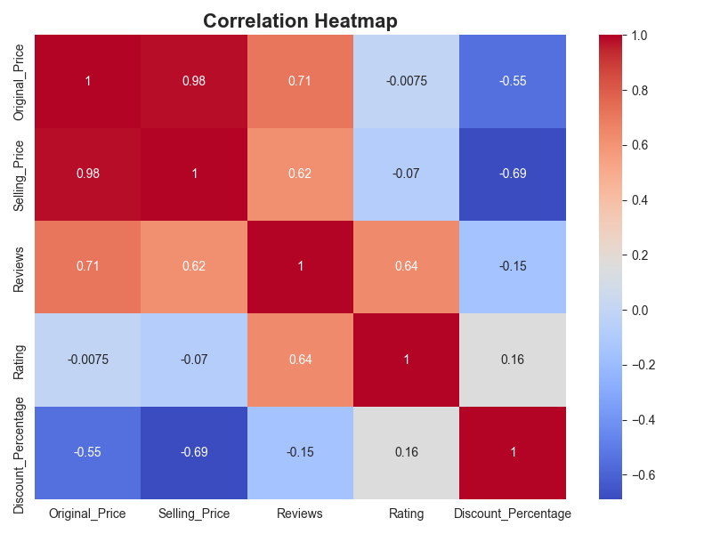
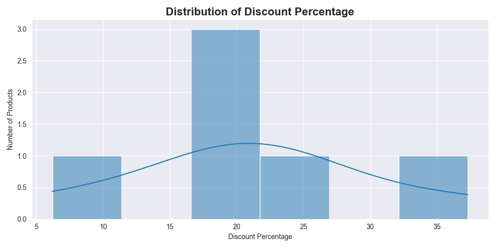
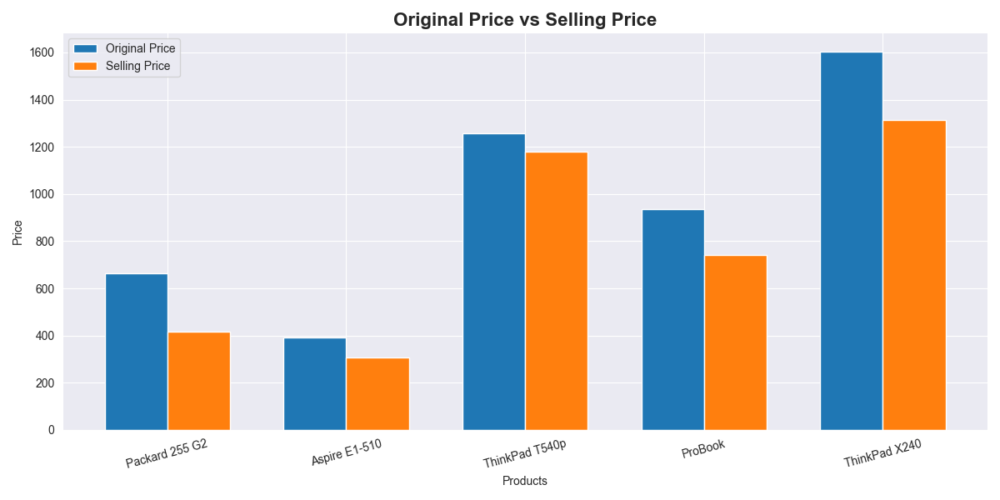
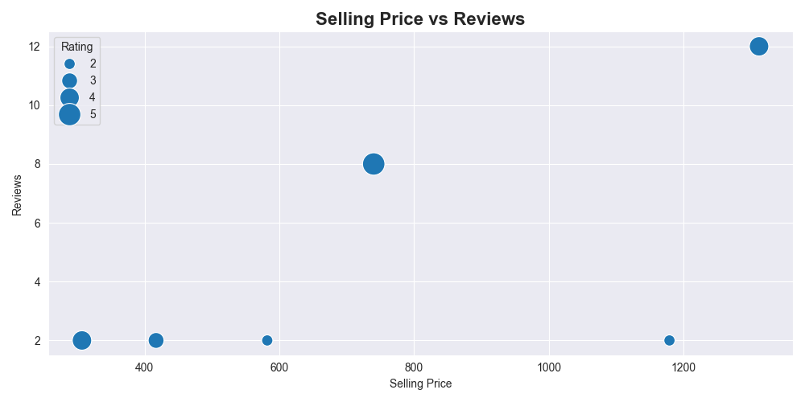
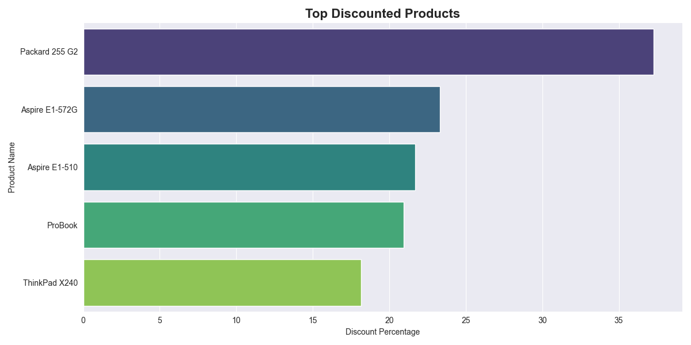
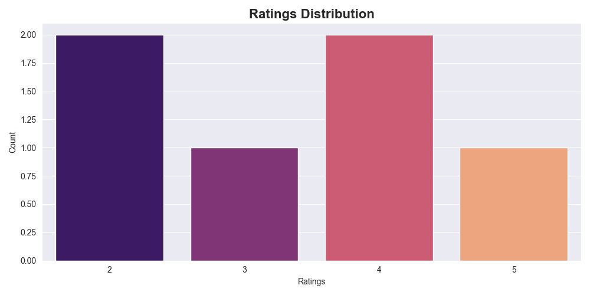
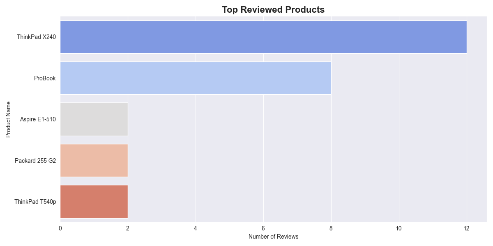

# Dynamic Pricing Analysis using Web Scraping

<p align="center">
  
</p>

<p align="center">
  <b>Web Scraping • Data Cleaning • Exploratory Data Analysis • Data Visualization</b>
</p>

---

## Project Overview

This project focuses on performing **Dynamic Pricing Analysis** on laptop products collected from an e-commerce website using Python. The workflow includes web scraping, data preprocessing, exploratory data analysis (EDA), and advanced visualizations to analyze pricing trends, discount strategies, customer reviews, and product ratings.

The project demonstrates practical implementation of:
- Web Scraping
- Data Cleaning
- Exploratory Data Analysis
- Dynamic Pricing Analytics
- Data Visualization

---

## Tech Stack

| Technology | Purpose |
|------------|---------|
| Python | Core Programming |
| BeautifulSoup | Web Scraping |
| Requests | HTTP Requests |
| Pandas | Data Cleaning & Analysis |
| Matplotlib | Data Visualization |
| Seaborn | Statistical Visualization |

---

## Dataset Source

Data collected from:

https://webscraper.io/test-sites/e-commerce/static/computers/laptops

---

# Project Workflow

```text
Web Scraping
      ↓
Data Cleaning
      ↓
Exploratory Data Analysis
      ↓
Dynamic Pricing Analysis
      ↓
Data Visualization
```

---

# Project Structure

```bash
dynamic-pricing-analysis/
│
├── scraper.py
├── data_cleaning.py
├── eda.py
├── visualization.py
│
├── raw_dynamic_pricing_data.csv
├── cleaned_dynamic_pricing_data.csv
├── dynamic_pricing_analysis.csv
│
├── images/
│   ├── discount_distribution.png
│   ├── price_comparison.png
│   ├── scatter_plot.png
│   ├── top_discounted.png
│   ├── ratings_distribution.png
│   ├── heatmap.png
│   └── top_reviewed.png
│
├── README.md
├── requirements.txt
└── .gitignore
```

---

# Features

- Extracts laptop product data from e-commerce websites
- Performs automated data cleaning and preprocessing
- Calculates dynamic discount percentages
- Identifies highly discounted and highly reviewed products
- Generates advanced analytical visualizations
- Provides pricing and customer behavior insights

---

# Data Processing Pipeline

## 1. Web Scraping

The scraping module collects:
- Product Names
- Original Prices
- Selling Prices
- Ratings
- Review Counts

### Output
```bash
raw_dynamic_pricing_data.csv
```

---

## 2. Data Cleaning

The preprocessing stage includes:
- Duplicate removal
- Missing value checking
- Numerical review extraction
- Data type conversion

### Output
```bash
cleaned_dynamic_pricing_data.csv
```

---

## 3. Dynamic Pricing Analysis

The analysis module computes:
- Discount Percentage
- Average Discounts
- Highest Discounted Products
- Most Expensive Products
- Most Reviewed Products

### Formula Used

```python
Discount Percentage =
((Original Price - Selling Price)
/ Original Price) * 100
```

### Output
```bash
dynamic_pricing_analysis.csv
```

---

# Data Visualization

## Discount Percentage Distribution

<p align="center">
  
</p>

This histogram visualizes how discount percentages are distributed across products.

---

## Original Price vs Selling Price

<p align="center">
  
</p>

Comparison between original product prices and discounted selling prices.

---

## Selling Price vs Reviews

<p align="center">
  
</p>

Scatter plot showing the relationship between selling prices and customer reviews.

---

## Top Discounted Products

<p align="center">
  
</p>

Visualization of products with the highest discount percentages.

---

## Ratings Distribution

<p align="center">
  
</p>

Distribution of customer ratings across products.

---

## Correlation Heatmap

<p align="center">
  
</p>

Correlation analysis between pricing, discounts, reviews, and ratings.

---

## Top Reviewed Products

<p align="center">
  
</p>

Products with the highest customer review counts.

---

# Key Insights

- Competitive discounts improve customer engagement.
- Products with strong ratings often receive higher reviews.
- Discount percentages significantly influence customer interest.
- Pricing trends reveal relationships between discounts and review behavior.

---

# Installation

Clone the repository:

```bash
git clone https://github.com/karthikjsherigar04-ctrl/-Dynamic-Pricing-Analysis-using-Web-Scraping.git
```

Navigate into the project directory:

```bash
cd dynamic-pricing-analysis
```

Install dependencies:

```bash
pip install -r requirements.txt
```

---

# How to Run

## Run Web Scraper

```bash
python scraper.py
```

## Run Data Cleaning

```bash
python data_cleaning.py
```

## Run EDA Analysis

```bash
python eda.py
```

## Generate Visualizations

```bash
python visualization.py
```

---

# Future Enhancements

- Real-time pricing updates
- Machine Learning based price prediction
- Interactive dashboards using Streamlit
- Automated reporting system
- Database integration

---

# Learning Outcomes

This project helped in gaining practical experience in:
- Web Scraping
- Data Preprocessing
- Exploratory Data Analysis
- Business Analytics
- Data Visualization
- Python-based Automation

---

# Author

## Karthik J

Aspiring Data Analyst | Python Developer | Data Visualization Enthusiast

---

# License

This project is developed for educational and learning purposes.
